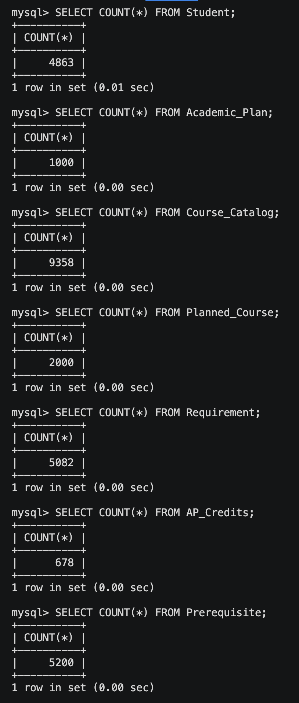
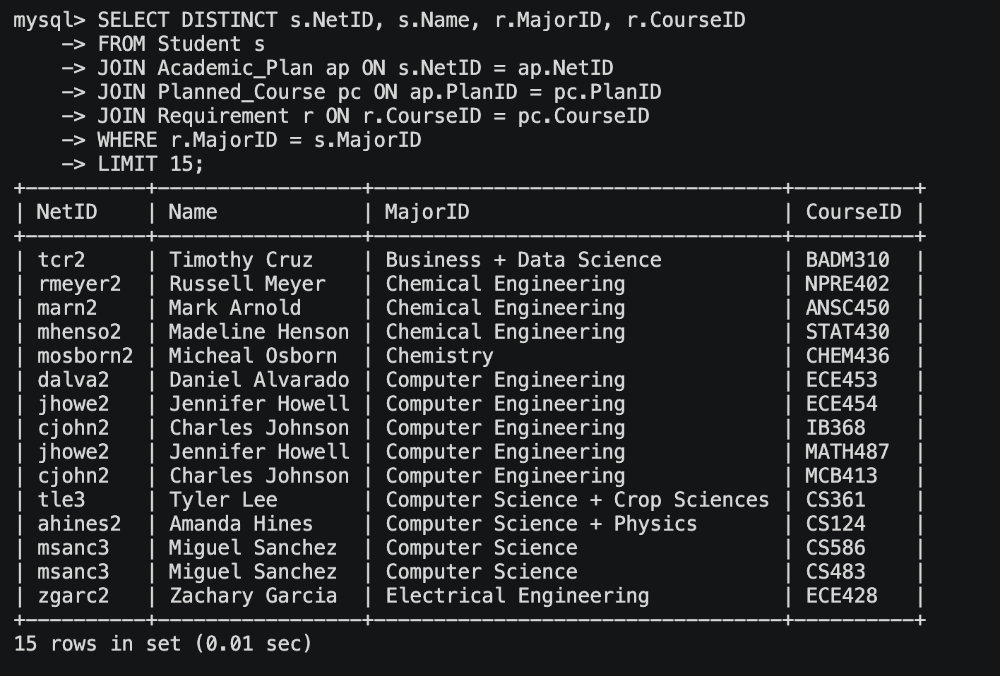
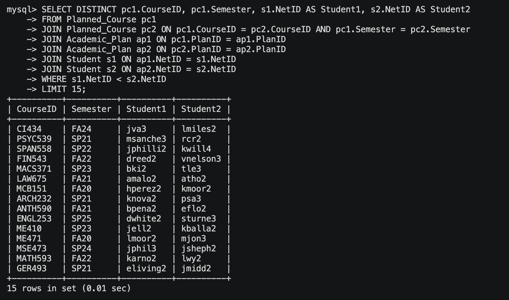

# Stage 3: Database implementation

## Database schema

The database schema is defined in the file `schema.sql`. And we are using `sqlite3` to implement the database.
We will create the database by reading the schema and import the data from the CSV files.
Sqlite3 commands are as follows:

```bash
vashishth@Frickie-Pro doc % sqlite3 db.db
SQLite version 3.43.2 2023-10-10 13:08:14
Enter ".help" for usage hints.
sqlite> .read schema.sql
sqlite> .mode csv
sqlite> .headers on
sqlite> .import Student.csv Student
sqlite> .import Academic_Plan.csv Academic_Plan
sqlite> .import Course_Catalog.csv Course_Catalog
sqlite> .import Planned_Course.csv Planned_Course
sqlite> .import Requirement.csv Requirement
sqlite> .import AP_Credits.csv AP_Credits
sqlite> .import Prerequisite.csv Prerequisite
```

And then I made a dump sql file for mysql by using the following command:

```bash
sqlite3 db.db .dump > sqlite_dump.sql
```

We were having issues with sqlite and so we migrated the database to mysql. So that we can run mysql by using the following command:

```bash
mysql -u root -p curriculum < sqlite_dump.sql
```

## Count of rows in each table



## Queries

### Query 1: Find Students Who Have Planned Courses That Fulfill a Requirement

```sql
SELECT DISTINCT s.NetID, s.Name, r.MajorID, r.CourseID
FROM Student s
JOIN Academic_Plan ap ON s.NetID = ap.NetID
JOIN Planned_Course pc ON ap.PlanID = pc.PlanID
JOIN Requirement r ON r.CourseID = pc.CourseID
WHERE r.MajorID = s.MajorID
LIMIT 15;
```



### Query 2: Find Total Credits Planned by Each Student

```sql
SELECT DISTINCT s.NetID, s.Name, SUM(cc.Credits) AS Total_Planned_Credits
FROM Student s
JOIN Academic_Plan ap ON s.NetID = ap.NetID
JOIN Planned_Course pc ON ap.PlanID = pc.PlanID
JOIN Course_Catalog cc ON pc.CourseID = cc.CourseID
GROUP BY s.NetID, s.Name
ORDER BY Total_Planned_Credits DESC
LIMIT 15;
```


### Query 3: Find Requirements Not Yet Planned by Student with NetID = 'spo2'

```sql
SELECT DISTINCT r.RequirementID, r.CourseID, s.NetID, s.Name
FROM Requirement r
JOIN Student s ON r.MajorID = s.MajorID
WHERE r.CourseID NOT IN (
    SELECT pc.CourseID
    FROM Planned_Course pc
    JOIN Academic_Plan ap ON pc.PlanID = ap.PlanID
    WHERE ap.NetID = s.NetID
) AND s.NetID = 'spo2'
LIMIT 15;
```


### Query 4: Find Students Taking the Same Class in the Same Semester

```sql
SELECT DISTINCT pc1.CourseID, pc1.Semester, s1.NetID AS Student1, s2.NetID AS Student2
FROM Planned_Course pc1
JOIN Planned_Course pc2 ON pc1.CourseID = pc2.CourseID AND pc1.Semester = pc2.Semester
JOIN Academic_Plan ap1 ON pc1.PlanID = ap1.PlanID
JOIN Academic_Plan ap2 ON pc2.PlanID = ap2.PlanID
JOIN Student s1 ON ap1.NetID = s1.NetID
JOIN Student s2 ON ap2.NetID = s2.NetID
WHERE s1.NetID < s2.NetID
LIMIT 15;
```



## Indexing

### For query 1

```sql
EXPLAIN ANALYZE
SELECT DISTINCT s.NetID, s.Name, r.MajorID, r.CourseID
FROM Student s
JOIN Academic_Plan ap ON s.NetID = ap.NetID
JOIN Planned_Course pc ON ap.PlanID = pc.PlanID
JOIN Requirement r ON r.CourseID = pc.CourseID
WHERE r.MajorID = s.MajorID
LIMIT 15;
```


```sql
**Recommended Indexes:**
1. CREATE INDEX idx_requirement_majorid ON Requirement (MajorID);
2. CREATE INDEX idx_student_majorid ON Student (MajorID);
-- 3. CREATE INDEX idx_planned_course_semester ON Planned_Course (Semester);
```

### For query 2

```sql
EXPLAIN ANALYZE
SELECT DISTINCT s.NetID, s.Name, SUM(cc.Credits) AS Total_Planned_Credits
FROM Student s
JOIN Academic_Plan ap ON s.NetID = ap.NetID
JOIN Planned_Course pc ON ap.PlanID = pc.PlanID
JOIN Course_Catalog cc ON pc.CourseID = cc.CourseID
GROUP BY s.NetID, s.Name
ORDER BY Total_Planned_Credits DESC
LIMIT 15;
```


```sql
**Recommended Indexes:**
```

### For query 3

```sql
EXPLAIN ANALYZE
SELECT DISTINCT r.RequirementID, r.CourseID, s.NetID, s.Name
FROM Requirement r
JOIN Student s ON r.MajorID = s.MajorID
WHERE r.CourseID NOT IN (
    SELECT pc.CourseID
    FROM Planned_Course pc
    JOIN Academic_Plan ap ON pc.PlanID = ap.PlanID
    WHERE ap.NetID = s.NetID
) AND s.NetID = 'spo2'
LIMIT 15;
```


```sql
**Recommended Indexes:**
1. CREATE INDEX idx_course_catalog_courseID ON Course_Catalog(CourseID);
3. CREATE INDEX idx_planned_course_semester ON Planned_Course (Semester);
```

### For query 4

```sql
EXPLAIN ANALYZE
SELECT DISTINCT pc1.CourseID, pc1.Semester, s1.NetID AS Student1, s2.NetID AS Student2
FROM Planned_Course pc1
JOIN Planned_Course pc2 ON pc1.CourseID = pc2.CourseID AND pc1.Semester = pc2.Semester
JOIN Academic_Plan ap1 ON pc1.PlanID = ap1.PlanID
JOIN Academic_Plan ap2 ON pc2.PlanID = ap2.PlanID
JOIN Student s1 ON ap1.NetID = s1.NetID
JOIN Student s2 ON ap2.NetID = s2.NetID
WHERE s1.NetID < s2.NetID
LIMIT 15;
```


```sql
**Recommended Indexes:**
-- 1. CREATE INDEX idx_planned_course_semester ON Planned_Course (Semester);
-- 2. CREATE INDEX idx_academic_plan_creationdate ON Academic_Plan (CreationDate);
-- 3. CREATE INDEX idx_student_name ON Student (Name);
```

## Conclusion
